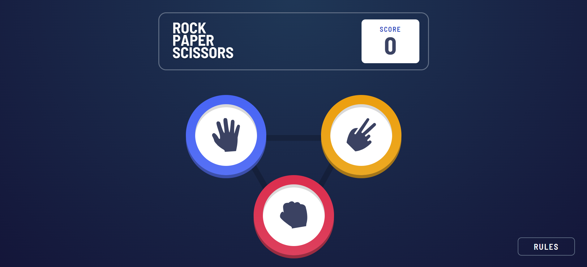
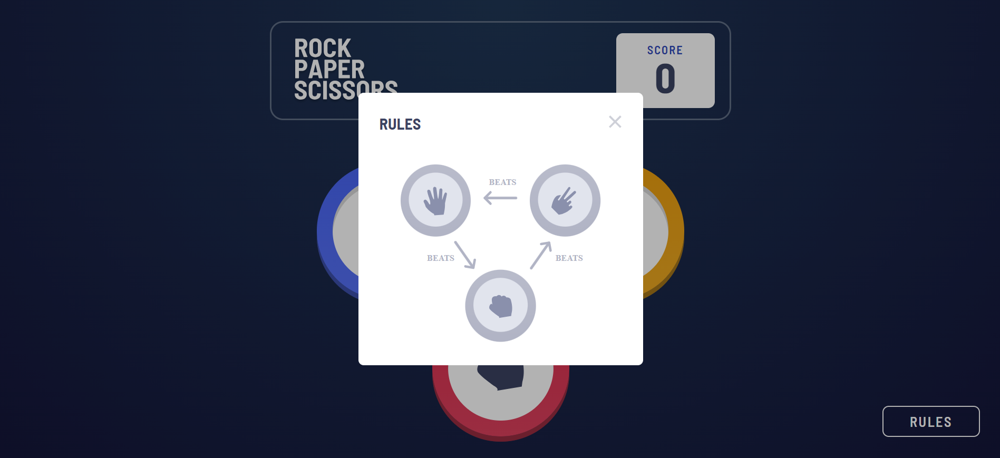
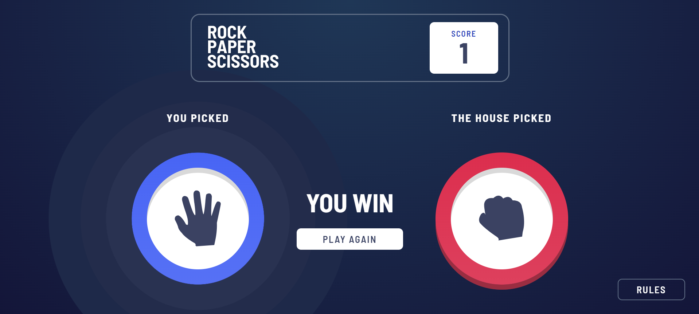
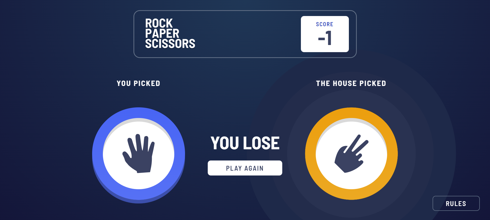
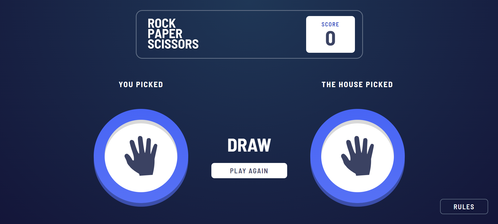

# Frontend Mentor - Rock, Paper, Scissors solution

This is a solution to the [Rock, Paper, Scissors challenge on Frontend Mentor](https://www.frontendmentor.io/challenges/rock-paper-scissors-game-pTgwgvgH). Frontend Mentor challenges help you improve your coding skills by building realistic projects.

## Overview

This project is a Rock, Paper, Scissors game with some additional features such as keeping score, displaying results, and allowing the player to play again. The technologies used in creating this project are HTML, CSS & JavaScript.

### The challenge

Your users should be able to:

Play Rock, Paper, Scissors against the computer.
View the optimal layout for the interface depending on their device's screen size.
See hover and focus states for all interactive elements on the page.

### Screenshot

This is the image of the game at its default stage.

This image shows the rules modal which opens when we click the rules button.

When the user wins, the choice of the user will have a gradient and the text in the results section shows "YOU WIN". Also the score will be increased by one point.

If the user loses, the choice of the computer will have a gradient and the text in the result section shows "YOU LOSE" and the score is decreased by one point. 

If the users choice and the computer's choice is same the text in the results section will show "DRAW" and there will be no gradient for both the user's and the computer's choice.

Also there is a "Play Again" button for the user to play several rounds.

### Links

- Solution URL: [Add solution URL here](https://your-solution-url.com)
- Live Site URL: [Add live site URL here](https://your-live-site-url.com)

## My process

### Built with

- Semantic HTML5 markup
- CSS custom properties
- CSS Grid
- JavaScript

### Continued development

This is just the desktop version of the challenge. The project is yet be made responsive(mobile view supported).

## Author

- Frontend Mentor - [@yourusername](https://www.frontendmentor.io/profile/HarshaVardhanNandamuri)
- LinkedIn - [@yourusername](https://www.linkedin.com/in/bhanu-harsha-nandamuri-b31a80149/)

